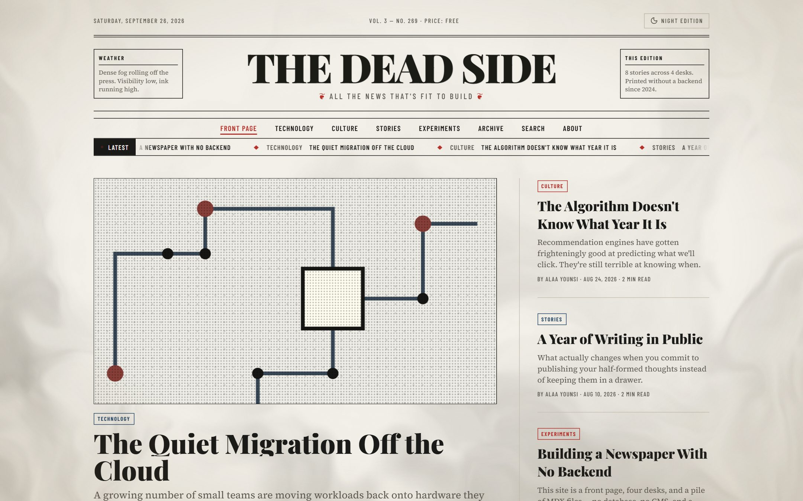
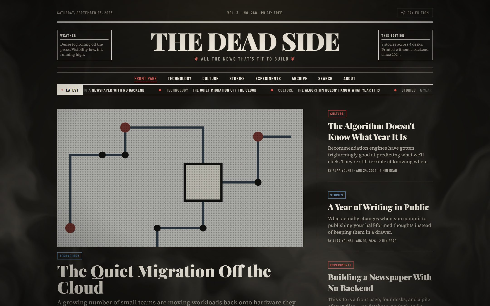
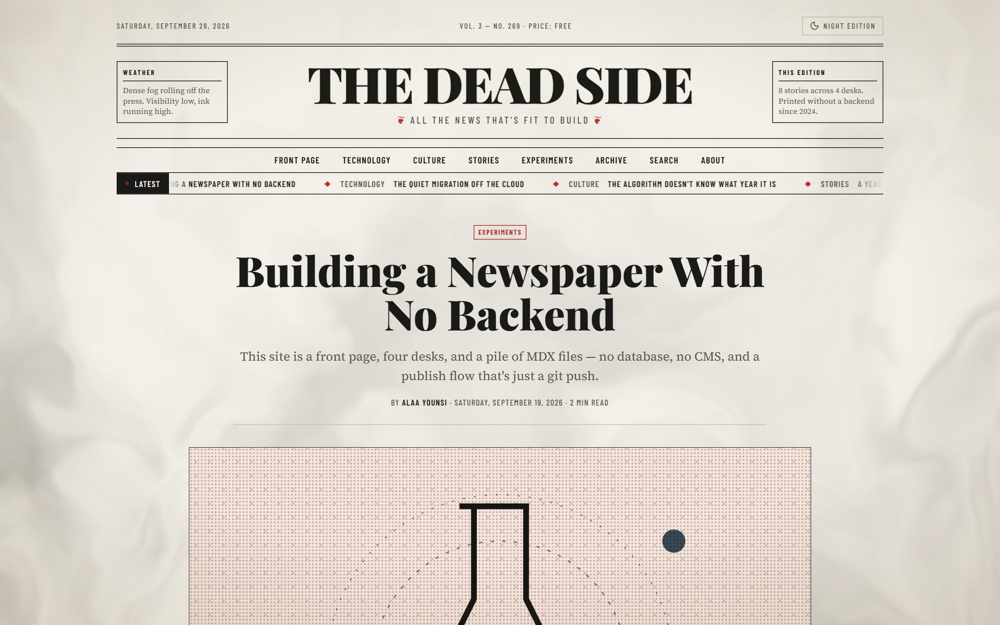
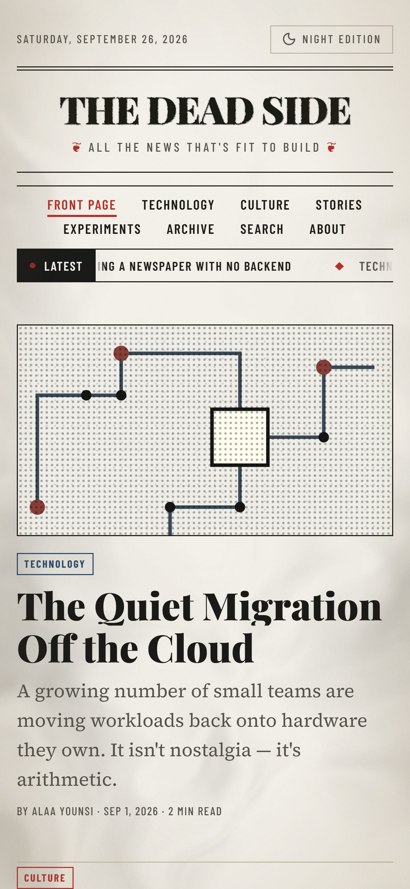
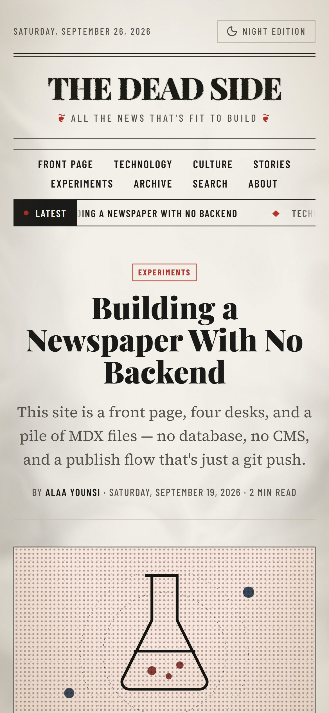
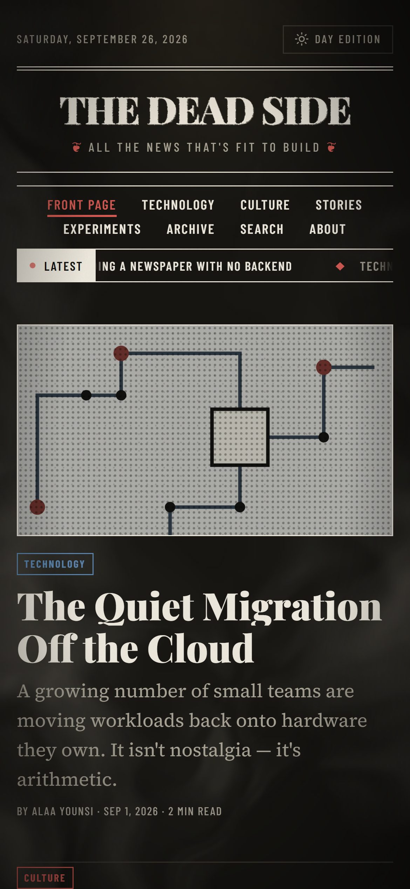

<div align="center">

# THE DEAD SIDE

**All the News That's Fit to Build**

A personal blog designed and engineered to read like a printed newspaper.

Designed and built by **[Alaa Younsi](https://github.com/Alaa-Younsi)**


[](LICENSE)

</div>



## About

The Dead Side is a personal publication of essays, stories, and experiments, organized into four desks: **Technology**, **Culture**, **Stories**, and **Experiments**.

The site has no database, CMS, or backend. Each article is an MDX file, validated against a typed schema when the site is built. Every page is prerendered as static HTML, so publishing a story means committing a file and pushing.

## Design

The idea is simple: **a blog should feel like picking up a newspaper**, not scrolling a feed. Every layout decision comes from print conventions.

- **Masthead and nameplate**: a heavy serif nameplate with a dateline, volume and issue number, and weather and edition boxes on either side.
- **Front-page hierarchy**: a lead story, a secondary column, briefs, and a section for each desk, arranged like the layout of a physical front page.
- **Editorial typography**: Playfair Display for headlines, Source Serif 4 for body text, and Barlow Condensed for datelines and labels. Articles use drop caps, pull quotes, bylines, and reading time.
- **Paper and ink**: a warm newsprint palette with press red and ink blue accents, a film-grain overlay, a vignette, and halftone-style desk illustrations.
- **Day and Night editions**: a theme toggle styled as a switch between editions. It remembers the reader's choice and follows the system preference on the first visit.
- **Atmosphere**: a WebGL fog layer drifts behind the page and reacts to the cursor. A short "rolling the presses" intro plays once per session, and a "Latest" ticker runs under the navigation.
- **Reading experience**: a reading progress bar, a table of contents, related stories from the same desk, and animated page transitions.

Every animation honors `prefers-reduced-motion`. When it's set, the intro is skipped, the fog stops moving, and transitions are removed.

## Screenshots

### Desktop

| Day edition | Night edition |
|---|---|
|  |  |



### Mobile

<p align="center">
  
  &nbsp;
  
  &nbsp;
  
</p>

## Features

- Front page, desk pages, article pages, a full archive, tag index and tag pages, an About page, and a 404 page
- Client-side fuzzy search across every article, built on Fuse.js
- RSS feed at `/feed.xml`
- An Open Graph image generated for each article
- MDX articles with syntax-highlighted code (Shiki) and custom components such as `<PullQuote>`
- Responsive layouts for phones, tablets, and desktops

## Tech Stack

| Layer | Technology |
|---|---|
| Framework | [Next.js 16](https://nextjs.org) (App Router, static generation) |
| UI | [React 19](https://react.dev), [TypeScript](https://www.typescriptlang.org) in strict mode |
| Styling | [Tailwind CSS 4](https://tailwindcss.com) with design tokens for both editions, plus `@tailwindcss/typography` |
| Content | [Velite](https://velite.js.org), a typed MDX content layer with Zod-validated frontmatter |
| Code highlighting | [Shiki](https://shiki.style) via `rehype-pretty-code` |
| Animation | [Motion](https://motion.dev) and a custom WebGL fragment shader for the fog |
| Search | [Fuse.js](https://www.fusejs.io) |
| Icons | [Lucide](https://lucide.dev) |
| Runtime and package manager | [Bun](https://bun.sh) |
| Linting and formatting | [Biome](https://biomejs.dev) |
| Hosting | [Vercel](https://vercel.com) |

## Performance

- **Fully static**: every page, desk, tag, and article is prerendered at build time, and unknown routes return a real 404 (`dynamicParams = false`). No server work runs per request.
- **Zero-runtime content**: MDX is compiled at build time by Velite, so the browser never downloads or runs an MDX parser.
- **Self-hosted fonts**: `next/font` subsets the fonts and serves them from the site's own domain with `font-display: swap`. There are no requests to external font servers and no layout shift from fonts loading.
- **Optimized images**: `next/image` serves AVIF and WebP in responsive sizes.
- **Lightweight fog**: the shader renders at a fraction of the viewport's resolution (lower on low-end devices), pauses when the tab is hidden, and draws a single static frame when reduced motion is on.
- **No flash of the wrong theme**: a small blocking script sets the edition before the first paint.
- **Caching**: hashed static assets are cached by Next.js defaults, and cover illustrations use `stale-while-revalidate`.

## Security

- **Strict Content Security Policy**: `default-src 'self'`, no third-party origins, `object-src 'none'`, `frame-ancestors 'none'`, and `form-action 'self'`. `unsafe-eval` is only enabled in development.
- **Hardened headers**: HSTS (two years, `includeSubDomains`, `preload`), `X-Frame-Options: DENY`, `X-Content-Type-Options: nosniff`, `Referrer-Policy: strict-origin-when-cross-origin`, and a `Permissions-Policy` that turns off camera, microphone, geolocation, and payment.
- **Sandboxed SVG handling**: images served through the optimizer get their own `script-src 'none'; sandbox` policy.
- **Small attack surface**: with no database, no authentication, no API routes that accept input, and no secrets, there is almost nothing to exploit. The only environment variable is the public site URL.
- **Build-time validation**: Velite runs in strict mode, so malformed content fails the build instead of reaching production.

## SEO

- Per-page `<title>` templates, meta descriptions, and Open Graph and Twitter Card metadata
- A dynamically generated Open Graph image for every article
- `Article` JSON-LD structured data with author, publish and modified dates, and publisher
- An auto-generated `sitemap.xml` covering every page, desk, tag, and article, with `lastModified` dates
- `robots.txt` pointing to the sitemap
- An RSS feed advertised through `<link rel="alternate">`
- Semantic HTML (`<article>`, `<main>`, `<nav>`) and a declared `lang` attribute
- Real 404 status codes for unknown routes, so crawlers don't index soft 404s

## Project Structure

```
app/              Routes: front page, desks, articles, archive, tags, search, about,
                  RSS feed, sitemap, robots, and Open Graph images
components/       Masthead, ticker, article cards, MDX renderer, fog, edition toggle, and more
content/posts/    Articles (.mdx)
lib/              Site config, desk definitions, content helpers, fonts
public/covers/    Desk illustrations (SVG)
velite.config.ts  Content schema
```

## Author

**Alaa Younsi** designed and built The Dead Side, including the concept, visual design, engineering, and writing.

- GitHub: [@Alaa-Younsi](https://github.com/Alaa-Younsi)

## License

Released under the [MIT License](LICENSE). Copyright © 2026 Alaa Younsi.
